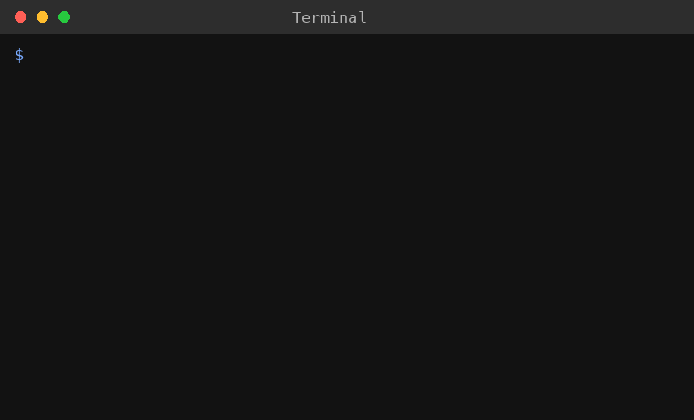

# 🔐 Gerador de Senhas



Um gerador de senhas aleatórias e seguras, feito em Python, com um menu interativo direto no terminal.

## 📋 O que o projeto faz

Gera senhas aleatórias combinando letras minúsculas, maiúsculas, números e símbolos, para ajudar você a criar senhas mais seguras.

## 🚀 Como usar

Rode o comando abaixo:

```bash
python gerador_senhas_interativo.py
```

Primeiro, escolha o tamanho da senha em um mini menu:

- 8 caracteres
- 12 caracteres
- 16 caracteres
- Ou digite outro tamanho de sua escolha

Depois que a senha for gerada, você pode:

- **R** → gerar uma nova senha
- **T** → trocar o tamanho da senha
- **Q** → sair do programa

## 🛠️ Requisitos

- Python 3 instalado no computador
